## About

<pre style='font-size: 9pt'>
           Blog - <a href="https://jinwei.me" target
="_blank">https://jinwei.me</a>
          Photo - <a href="https://photo.jinwei.me" target="_blank">https://photo.jinwei.me</a>
       Telegram - <a href="https://t.me/clarkzjw" target="_blank">@clarkzjw</a>
      Portfolio - <a href="https://pan.uvic.ca/~clarkzjw/" target="_blank">https://pan.uvic.ca/~clarkzjw/</a>
PGP Fingerprint - <a href="https://keys.openpgp.org/vks/v1/by-fingerprint/B878C370CF7D871FAA3C76637E1EB1851D017D3D" target="_blank">0xB878C370CF7D871FAA3C76637E1EB1851D017D3D</a>
            Tor - <a href="http://clarkzjwknnnynh5ckehzdkbpqp5hh5lflptqnxeh7igx6zjcmvpscqd.onion/" target="_blank">http://clarkzjwknnnynh5ckehzdkbpqp5hh5lflptqnxeh7igx6zjcmvpscqd.onion</a>
</pre>

## Some side projects
<pre style='font-size: 9pt'>
Overview of LEO-related research                   - <a href="https://oac.uvic.ca/starlink/" target="_blank">https://oac.uvic.ca/starlink/</a>
Unofficial OneWeb SNP/PoP Map                      - <a href="https://tinyurl.com/onewebmap" target="_blank">https://tinyurl.com/onewebmap</a>
LENS: A LEO Satellite Network Measurement Dataset  - <a href="https://github.com/clarkzjw/LENS", target="_blank">https://github.com/clarkzjw/LENS</a>
Starlink GeoIP Map Visualization                   - <a href="https://github.com/clarkzjw/starlink-geoip", target="_blank">https://github.com/clarkzjw/starlink-geoip</a>
Starlink GeoIP Data Snapshots                      - <a href="https://github.com/clarkzjw/starlink-geoip-data", target="_blank">https://github.com/clarkzjw/starlink-geoip-data</a>
Starlink latency and global backbone measurement   - <a href="https://github.com/clarkzjw/starlink-lens", target="_blank">https://github.com/clarkzjw/starlink-lens</a>
Starlink gRPC protobuf API for Golang              - <a href="https://github.com/clarkzjw/starlink-grpc-golang", target="_blank">https://github.com/clarkzjw/starlink-grpc-golang</a>
Starlink Prometheus Exporter                       - <a href="https://github.com/clarkzjw/starlink_exporter", target="_blank">https://github.com/clarkzjw/starlink_exporter</a>
</pre>

